# Azure Sentinel SOC Lab 🚨

This project demonstrates how to build a complete SOC lab environment using Microsoft Sentinel on Azure — from subscription creation to detecting malicious login attempts and visualizing attacks on a map.

---

## 🔐 Project Goals

- Simulate a SOC environment using Azure tools
- Collect logs from a virtual machine
- Forward logs to Microsoft Sentinel
- Detect failed login attempts
- Visualize attacker IPs on a world map

---

## 📦 Step-by-Step Setup

### 1. Azure Subscription (Using Student Email)
- Created a student Azure account using school email
- Got access to $100 in free credits and Azure for Students

### 🧑‍🎓 Don't have a student email?
See [`setup/student-alternative-subscription.md`](setup/student-alternative-subscription.md) for alternatives (e.g. free trial + credit card).

### 2. Resource Group and VNet
markdown
Copy
Edit
### 2. Resource Group and VNet

#### ✅ Creating a Resource Group

1. Go to the [Azure Portal](https://portal.azure.com).
2. In the search bar at the top, type `Resource groups`.  
   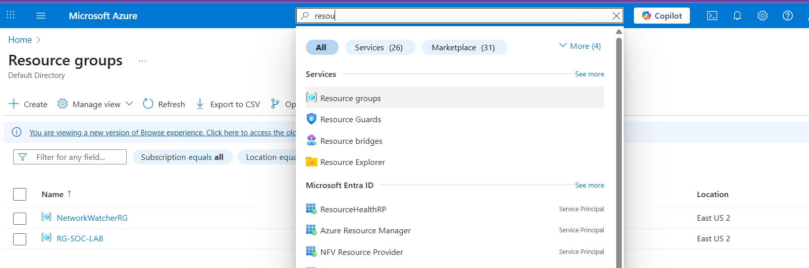
3. Click the **Create** button.  
   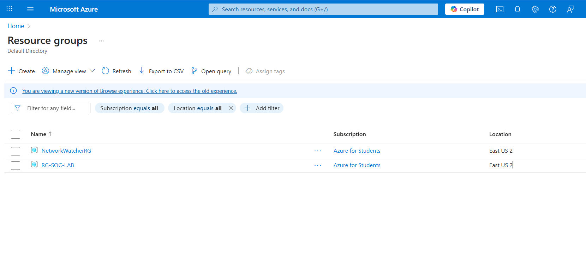
4. In the creation form:
   - Select your **Azure subscription**
   - Choose a **region**
   - Enter the **Resource Group name** (e.g., `RG-SOC-LAB`)  
   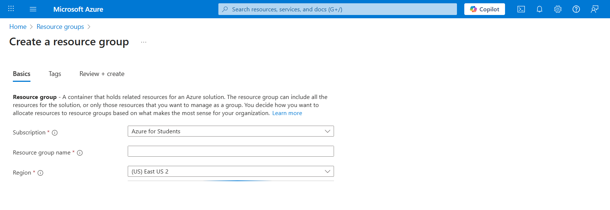
5. Click **Review + Create**, then finally click **Create**.

---

#### 🌐 Creating a Virtual Network

1. In the Azure Portal, search for `Virtual networks`.  
   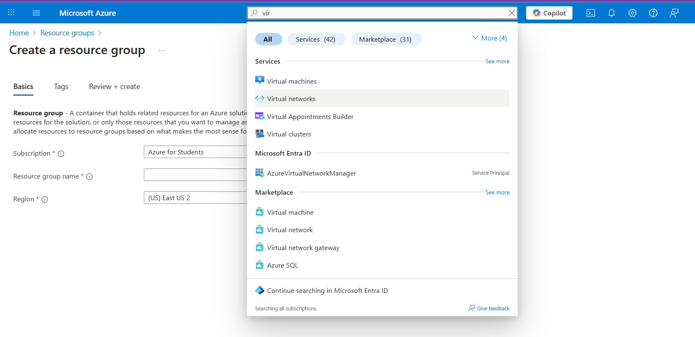
2. Click **Create** and select the **existing resource group** `RG-SOC-LAB`.  
   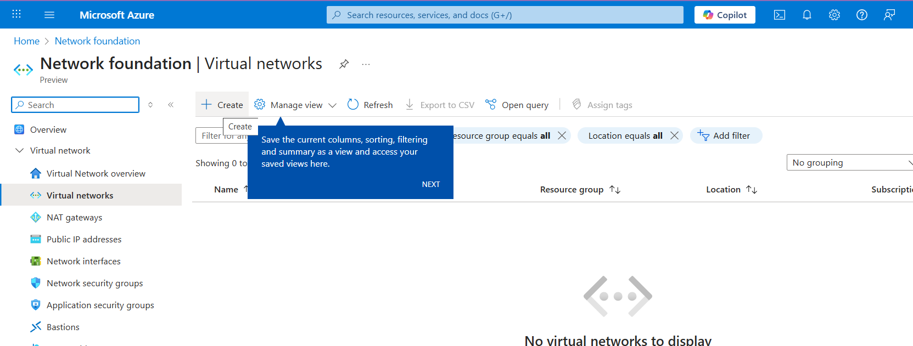
3. Enter a name for the VNet, e.g. `Vnet-soc-lab`, and complete the required fields.  
   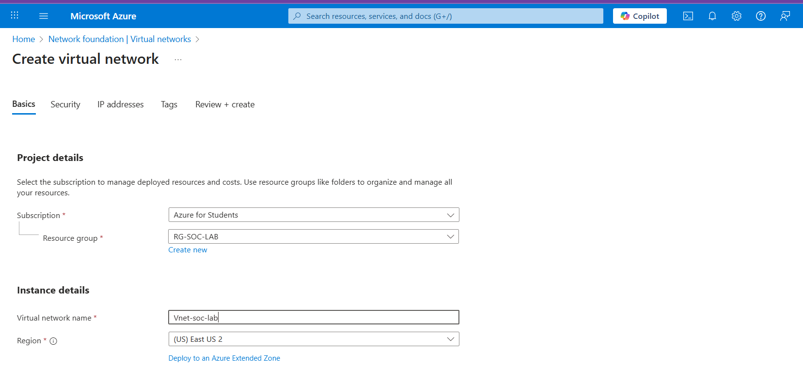
4. Click **Review + Create**, then **Create** to finish deploying the virtual network.

### 3. Virtual Machine (VM) Creation

### 3. Virtual Machine (VM) Creation

#### 🖥️ Creating the Virtual Machine

1. In the Azure Portal, search for `Virtual machines`.  
   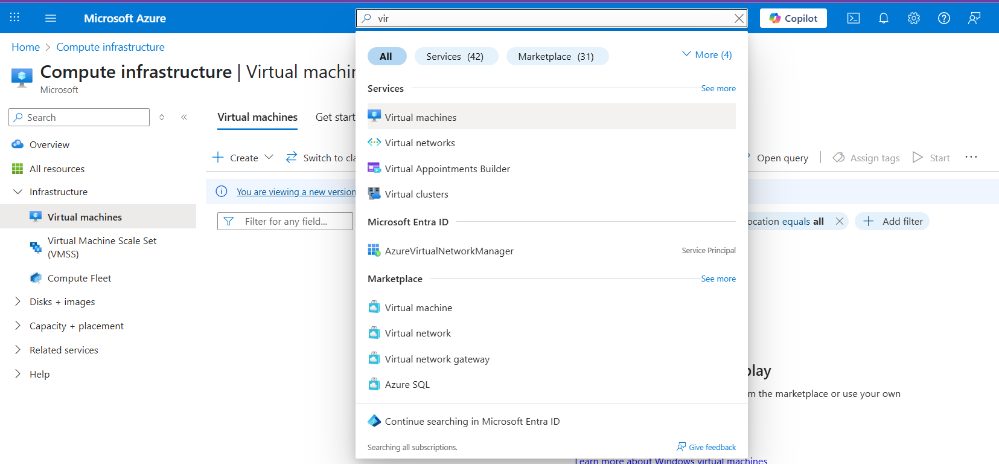
2. Click **Create**, and choose the **existing resource group** `RG-SOC-LAB`.  
   
3. In the Basics tab, fill in the following details:  
   - **VM Name:** `CORP-NET-EAST-1`  
   - **Image:** *Windows 10 Pro N, version 22H2 - x64 Gen2*  
   - **Username:** `labuser`  
   - **Password:** your choice  
   - ✅ Check **“I confirm I have an eligible Windows 10/11 license...”**
4. Click through to the other tabs:
   - **Disks:** keep default
   - **Networking:** select `Vnet-soc-lab`  
     ✅ Check **Delete public IP and NIC when VM is deleted**
   - All other settings: leave as default  
   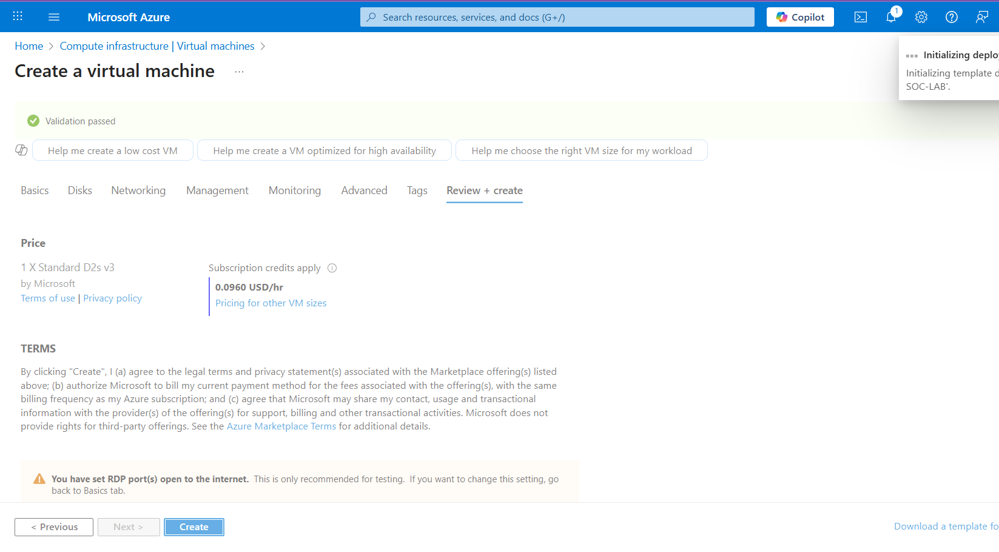
5. Click **Review + Create**, then **Create**.

---

### 4. Configure Firewall (NSG)

Once the deployment is complete:

1. Go to `Resource groups` → Select `RG-SOC-LAB`
2. Click on **`CORP-NET-EAST-1-nsg`**  
   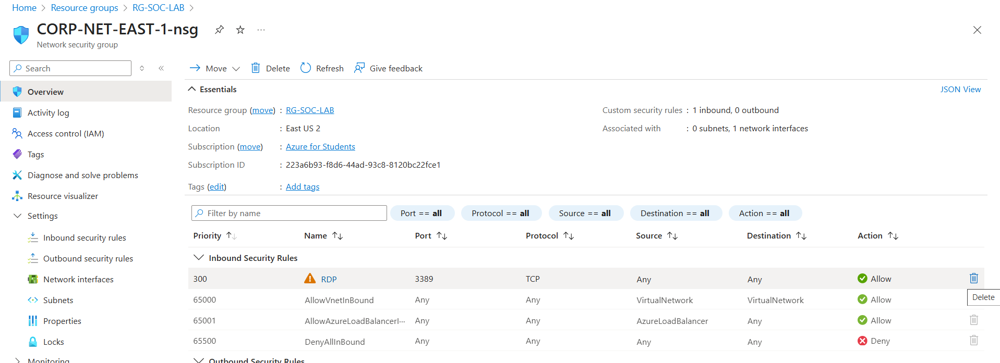
3. Delete the default **RDP rule** by clicking the trash icon.  
   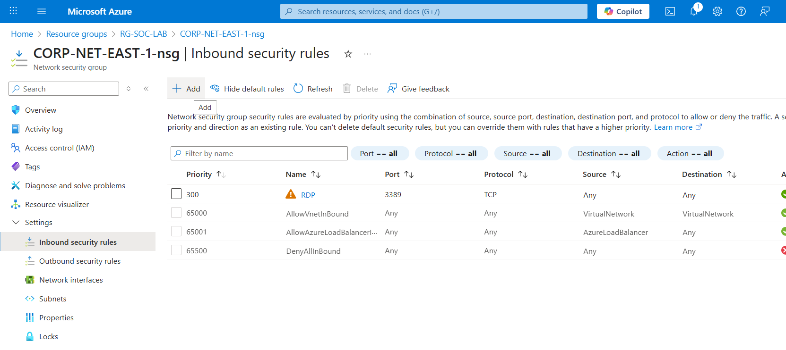
4. Click on **Inbound security rules** → **Add rule**
5. In the new rule:
   - **Source:** Any
   - **Destination:** Any
   - **Port:** Any
   - **Protocol:** Any
   - **Action:** Allow
   - **Priority:** 100
   - **Name:** AllowAll
   - Description: Honeypot Lab  
   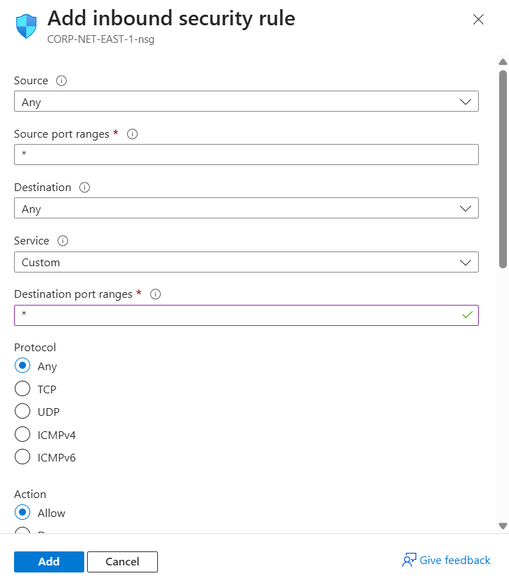
6. Click **Add** to save the rule.

---

### 5. Connect to the VM from Host Machine

#### 💻 Remote Desktop Access

1. In the Azure Portal, search for `Virtual machines`
2. Select the VM `CORP-NET-EAST-1`  
   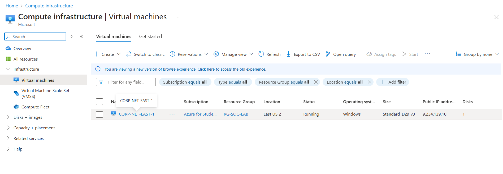
3. Copy the **Public IP address**  
   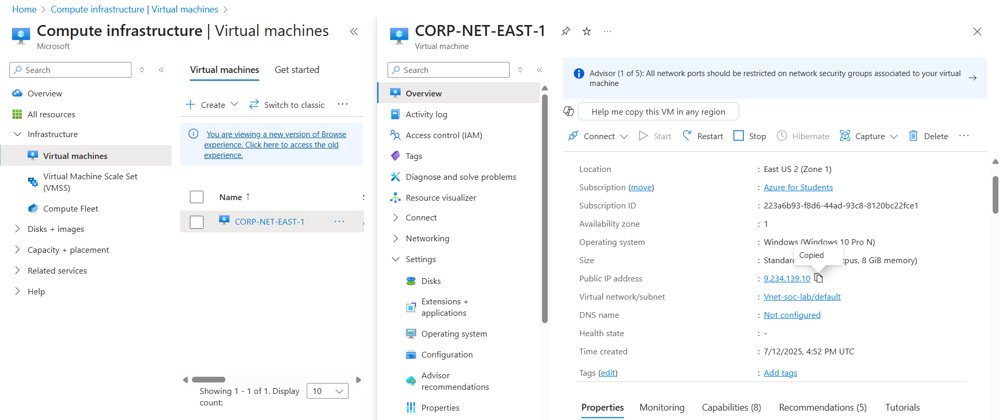
4. On your **host machine**, open the **Remote Desktop Connection** tool.
5. Paste the VM's Public IP address.  
   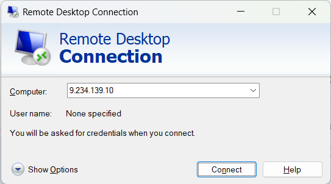
6. Enter the credentials:
   - **Username:** `labuser`
   - **Password:** the one you set
7. Click **Connect**, then **Yes** to accept the certificate prompt.  
   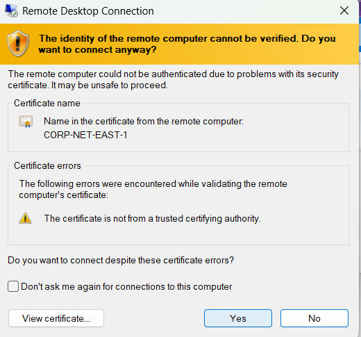

---

### 6. Disable Windows Firewall in the VM

Once inside the VM via RDP:

1. Open the **Start menu** and search for **"Firewall & network protection"**  
   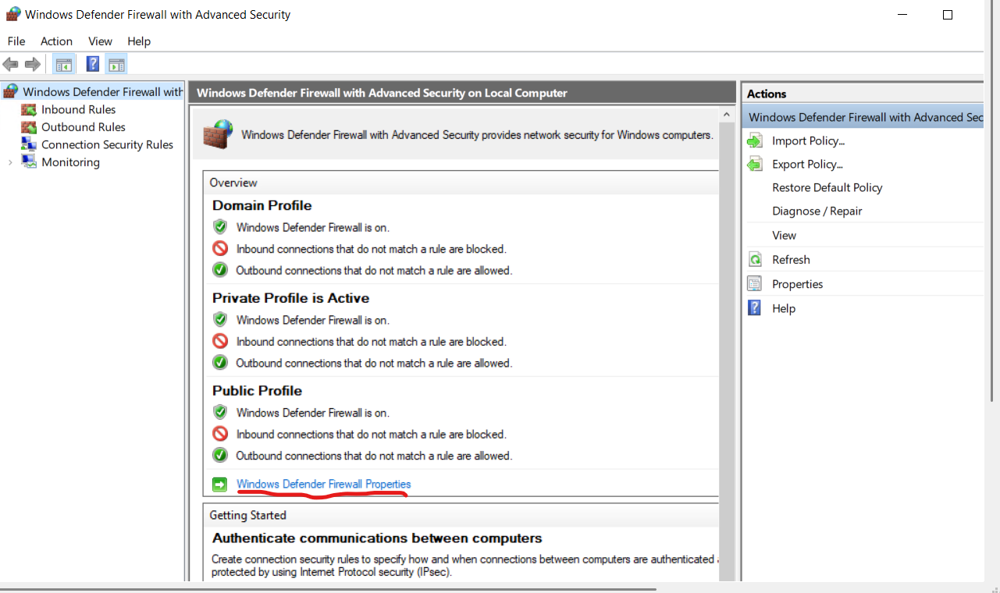
2. Turn off all three profiles:
   - **Domain network**
   - **Private network**
   - **Public network**  
   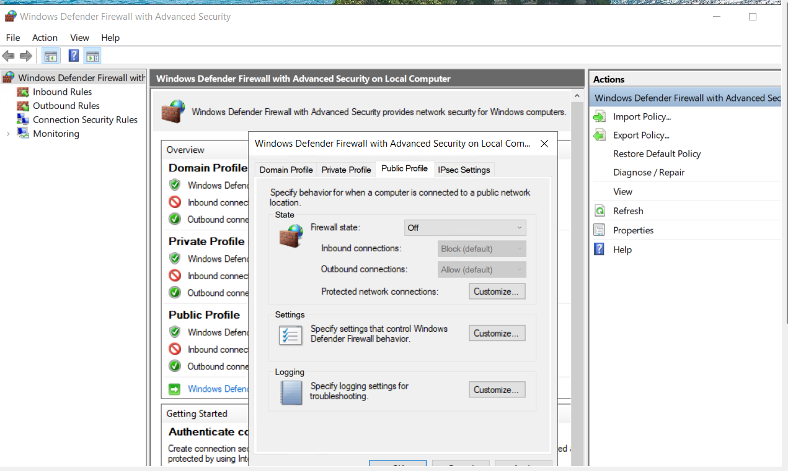

---

✅ Now, from your **host machine**, you should be able to ping the VM successfully, as the firewall is disabled and NSG allows all traffic.

---


### 4. Log Collection
- Triggered a failed login (EventID 4625)
- Verified via Event Viewer → Security logs

### 5. Log Analytics Workspace & Sentinel
- Created: `LAW-soc-lab-0000`
- Connected Sentinel to LAW
- Installed "Security Events" content

### 6. Forwarding VM Logs to Sentinel
- Created a Data Collection Rule (DCR)
- Enabled forwarding Windows security logs

### 7. GeoIP Watchlist
- Uploaded IP database to Watchlist (name: `geoip`)

### 8. Query & Map Visualization

**KQL Query:** [`queries/geoip-attack-map.kql`](queries/geoip-attack-map.kql)

**Attack Map:** See [`screenshots/attack-map.png`](screenshots/attack-map.png)

```kusto
let GeoIPDB_FULL = _GetWatchlist("geoip");
let WindowsEvents = SecurityEvent
    | where IpAddress == "92.63.197.9"
    | where EventID == 4625
    | order by TimeGenerated desc
    | evaluate ipv4_lookup(GeoIPDB_FULL, IpAddress, network);
WindowsEvents
| project TimeGenerated, Computer, Attacker_IP = IpAddress, cityname, countryname, latitude, longitude
